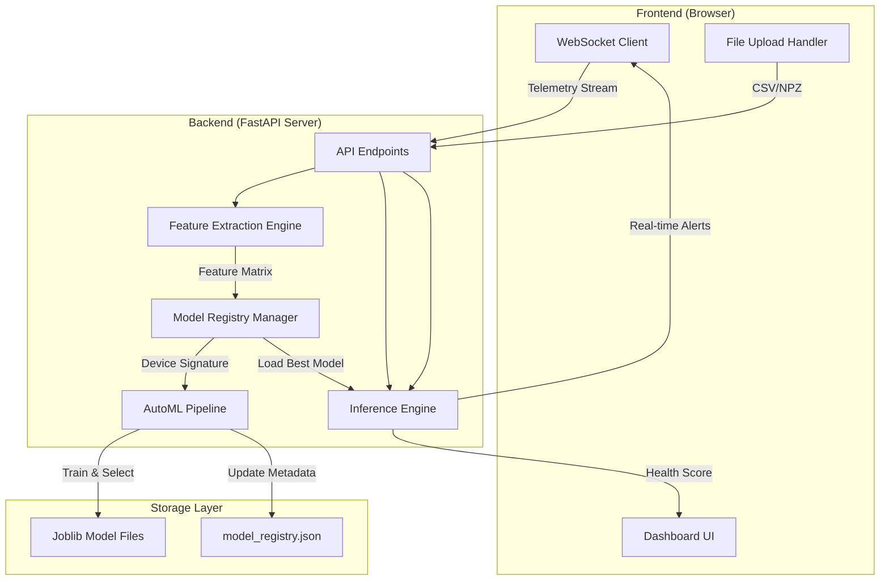
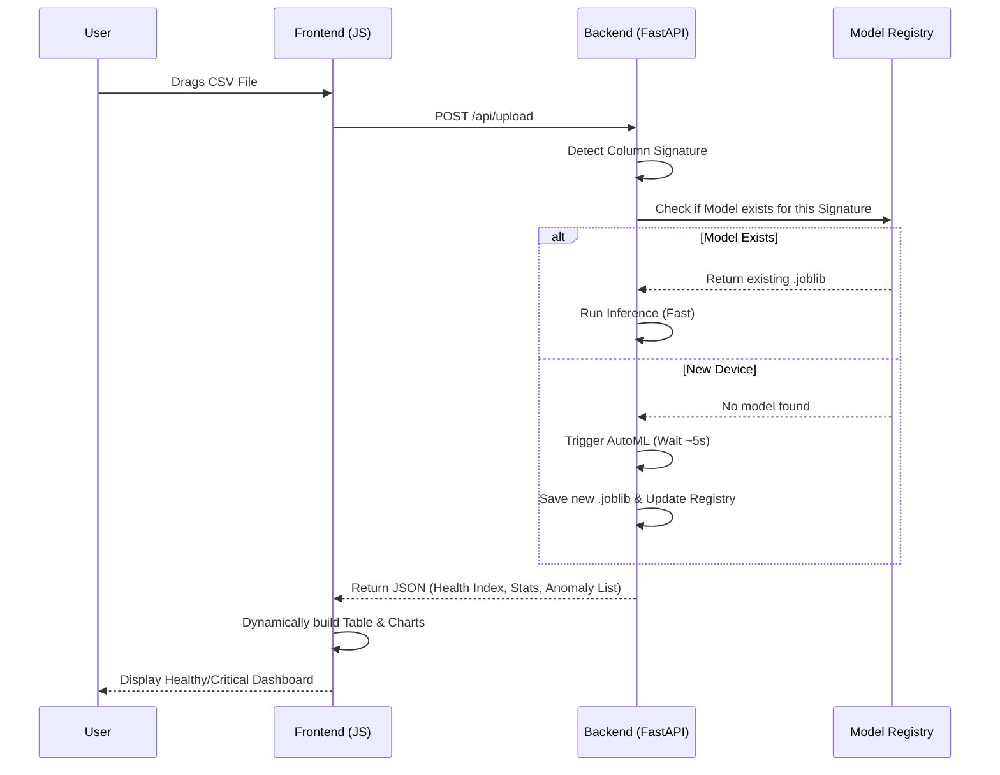

# System Architecture Deep-Dive: IoT Predictive Maintenance AI

This document outlines the end-to-end technical architecture, data flow, and operational boundaries of the Predictive Maintenance system.

---

## 1. High-Level System Flow (Mermaid)

---

## 2. Component Architecture

### A. Data Ingestion Layer (Feature Extraction)
*   **CSV Pipeline**: Parses numeric columns dynamically. Filters out metadata (timestamps, IDs).
*   **NPZ Pipeline (Legacy)**: Performs high-speed signal processing on raw vibration arrays.
    *   *Mathematical Features*: RMS Velocity, Kurtosis, Skewness, Std Dev, Mean, Min/Max.
*   **Signature Engine**: Generates a MD5 hash of the column names. This "Device Key" ensures the system knows exactly which model belongs to which hardware.

### B. Multi-Model Registry (Persistence)
Instead of a single monolithic model, the system uses a **Registry Design Pattern**.
*   **Registry Entry**: Stores `device_key`, `algorithm`, `contamination`, `trained_feature_cols`, and `upload_count`.
*   **Conflict Resolution**: If a user uploads data with new columns, the registry creates a *new* model file rather than overwriting the old one. This preserves specialized models for different industrial fans.

### C. AutoML & Inference Core
*   **The Duel**: Compares **Isolation Forest** (Global anomalies) vs **Local Outlier Factor** (Local density anomalies).
*   **The Optimizer**: Uses the "Histogram Elbow" method to automatically set the contamination % based on the dataset's specific noise profile.
*   **Health Mapping**: Converts raw model distances into a human-readable **0-100% Health Index**.

---

## 3. UI Architecture Flow

The Frontend follows a **Linear Pipeline State Machine**:

1.  **IDLE**: Waiting for file input.
2.  **UPLOADING**: Multi-part form data transmission.
3.  **PROCESSING**: Backend is running AutoML. UI shows "Automl Logs" via a step-by-step status stream.
4.  **RENDER_DASHBOARD**:
    *   *Chart.js*: Renders the Health Timeline.
    *   *Dynamic Headers*: Table headers are built on-the-fly based on the JSON response keys.
5.  **REPORT_GEN**: Compiles the final state into a downloadable summary.

---

## 4. Operational Scenarios (Works vs. Breaks)

### ✅ Where it works (Success Scenarios)
*   **Industrial Fan Coil (High Freq)**: Handles raw .npz files with 32kHz vibration data.
*   **CPU Cooling Fan (Low Freq)**: Handles simple .csv telemetry (Temp, Accel).
*   **Heterogeneous Fleet**: Works across a factory with 10 different types of fans simultaneously.
*   **Live Monitoring**: Provides real-time "Healthy/Degraded" labels over WebSockets.

### ⚠️ Edge Scenarios (The System Adapts)
*   **Missing Features**: If 1 out of 14 features is missing, the system detects a "New Device" and triggers a retraining to build a compatible model for the degraded sensor set.
*   **High Noise**: The Contamination Optimizer expands the threshold if the baseline noise is high, preventing excessive false alarms.

### ❌ Where it breaks (Failure Scenarios)
*   **Non-Numeric Data**: If the CSV contains only strings (e.g., "Status: OK"), the Feature Extraction engine will throw a `422 Unprocessable Entity` error.
*   **Tiny Datasets**: Training on <10 samples will fail. The system requires at least 10 rows to build a statistical distribution.
*   **Schema Collisions**: If two different machines have the *exact same* column names but different physics, the system will use the same model (unless a `device_id` is passed in the header).
*   **Memory Exhaustion**: Uploading a 5GB CSV might crash the server as Pandas loads the entire dataframe into RAM. *Future optimization needed: Chunked reading.*

---

## 5. UI Logic Flow Diagram

---

> [!IMPORTANT]
> **Key Architectural Goal**: The system is designed to be **Zero-Touch**. The end-user should never have to select an algorithm or tell the AI what columns it is looking at; the backend "self-discovers" the machine's configuration through its data signature.
